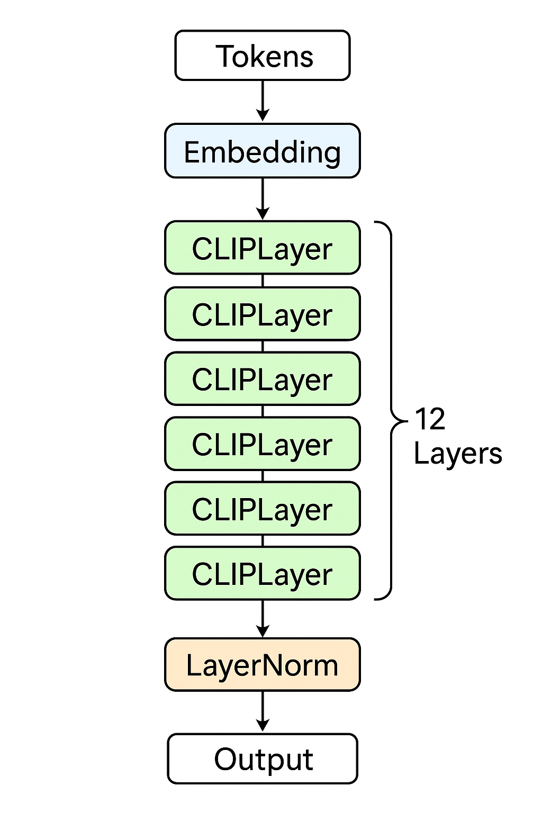
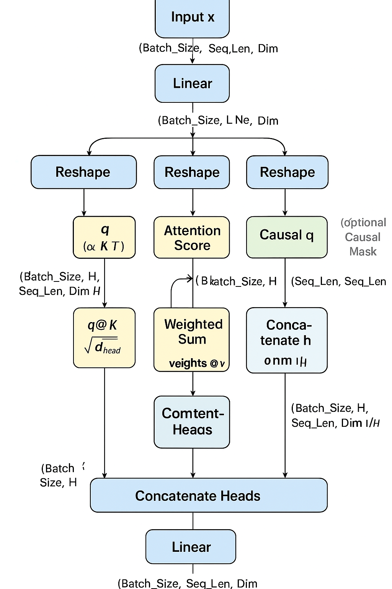
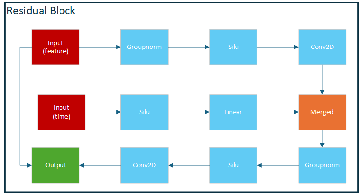
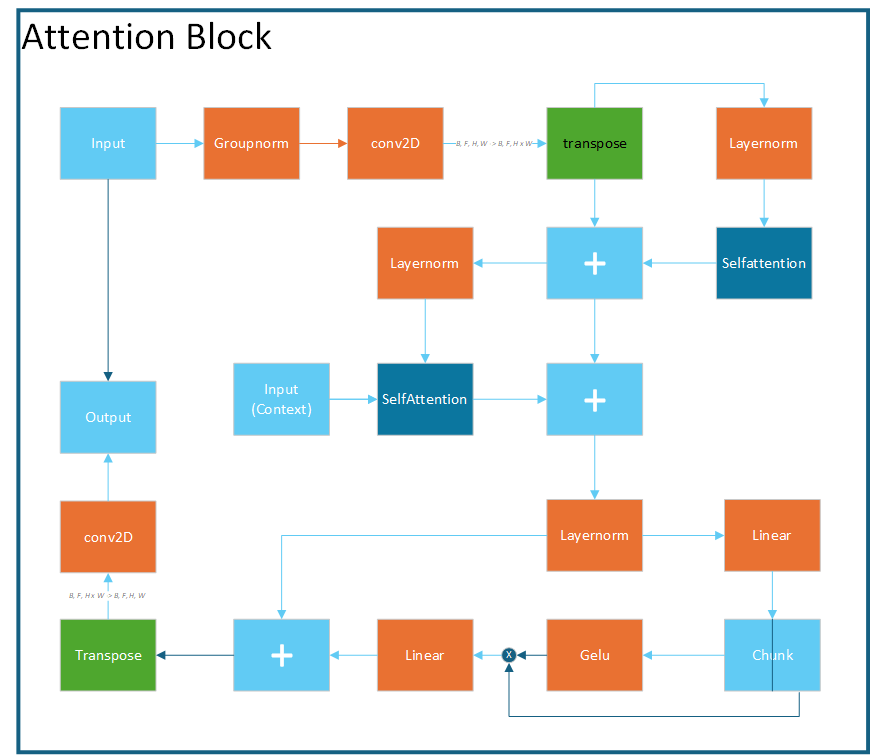
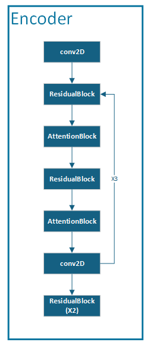
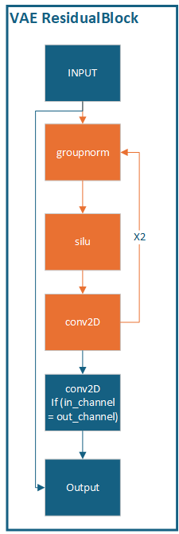
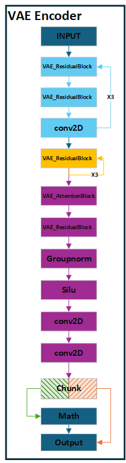
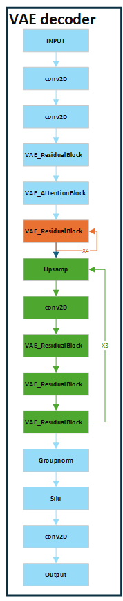

# appgenAI
create app, genAI, predict, ...

with genAI, we create with clip (from ViT-B/32 include embedded, 12 layer CLIP, layernorm)
in CLIP layer have:
 + residual connection (1 layernorm, self attention(like transformer))
 + feedforward (layernorm, linear, gelu, linear)

# CLIP
    embedded
    12:
        CLIPlayer
    layernorm
## CLIP layer
    layernorm
    selfattention
    layernorm
    linear
    sigmod
    linear

# diffusion model

## time_embedded
    linear( embed, 4*embed)
    linear( 4*embed, 4*embed)

## Unet model
### encoder
    conv2D (4, 320)
    3:
        ResidualBlock (320, 320), (320, 640), (640, 1280)
        AttentionBlock (8, 40), (8, 80), (8, 160)
        ResidualBlock (320, 320), (640, 640), (1280, 1280)
        AttentionBlock (8, 40), (8, 80), (8, 160)
        conv2D  (320, 320), (640, 640), (1280, 1280)
    2:
        ResidualBlock (1280, 1280)

### bottleneck 
    ResidualBlock -> residual
        +(groupnorm, silu, conv2D) -> feature
        +(silu, Linear) -> time
        +(feature + time, groupnorm, silu, conv2D) -> merged
        + merged + residual
    AttentionBlock -> x
        + groupnorm, conv2D, transpose -> x
        + layernorm, selfattention1(same transformer) -> x = x + short
        + layernorm, selfattention2(same transformer but not include mask) -> x = x + short
        + layernorm, linear, chunk(= x, gate) -> x = x * gelu(gate)
        + linear -> x = x + short
        + transpose -> x
    ResidualBlock -> residual
        +(groupnorm, silu, conv2D) -> feature
        +(silu, Linear) -> time
        +(feature + time, groupnorm, silu, conv2D) -> merged
        + merged + residual

### decoder
    3:
        ResidualBlock
    conv2D
    9:
        ResidualBlock
        AttentionBlock

### Groupnorm
### conv2D
 

# VAE encoder
    conv2D
    3:
        VAE_ResidualBlock
        VAE_ResidualBlock
        conv2D
    3:
        VAE_ResidualBlock
    VAE_AttentionBlock
    VAE_ResidualBlock
    groupnorm
    Silu
    conv2D
    conv2D ->x, log(σ)^2
    (x + sqrt(e^(clamp(log(σ)^2, -30, 20))) * noise)* 0.18215

## VAE_ResidualBlock
    2:->x
        groupnorm
        silu
        conv2D
    conv2D(in)(option) + x

## VAE_AttentionBlock
    groupnorm
    transpose
    selfattention
    transpose

# VAE decoder
    conv2D
    conv2D
    VAE_ResidualBlock
    VAE_AttentionBlock
    4:
        VAE_ResidualBlock
    3:
        upsample
        conv2D
        VAE_ResidualBlock
        VAE_ResidualBlock
        VAE_ResidualBlock
    groupnorm
    Silu
    conv2D

 
 

